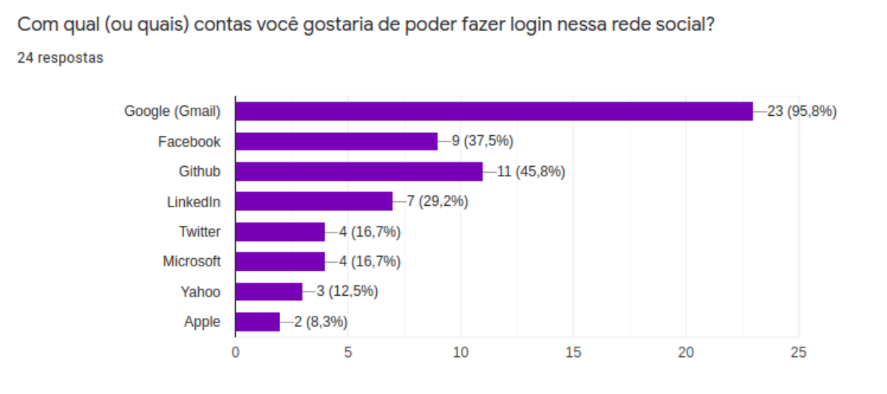
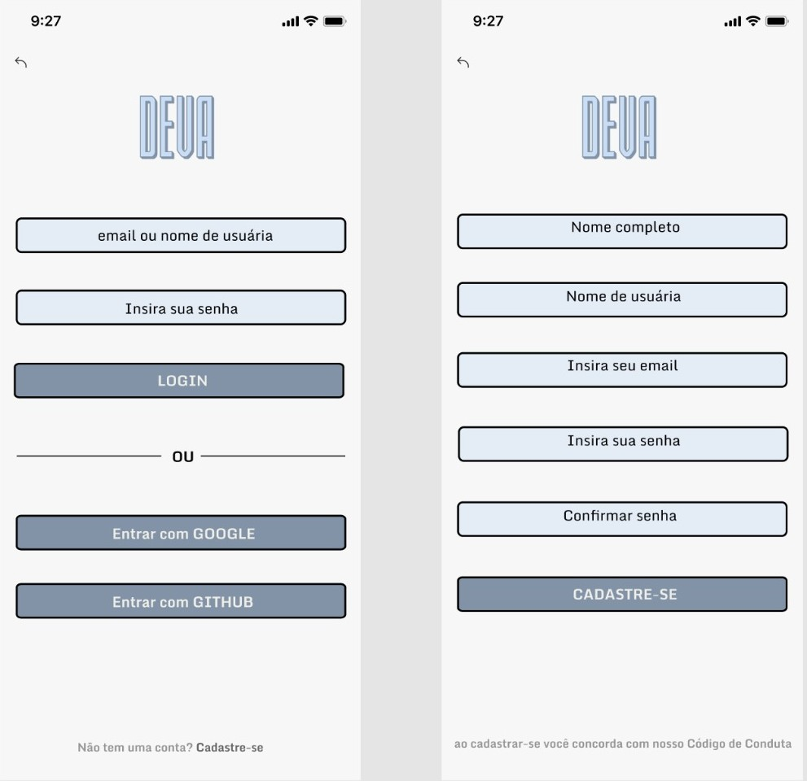
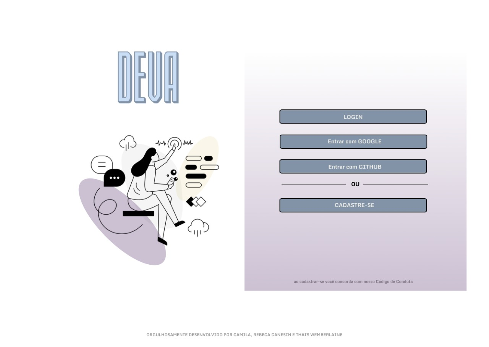

# DEVa | Social Network

DEVa é uma rede social desenvolvida por mulheres e para mulheres. Foi idealizada para ser um espaço de troca de conhecimento e uma rede de apoio entre mulheres desenvolvedoras. 
[**Acesse a  DEVa**](https://rede-social-79057.firebaseapp.com/) :purple_heart:
> Status do Projeto: Concluído :heavy_check_mark:

## Índice

- [1. Apresentação do Projeto](#1-apresentação-do-projeto)
- [2. Desenvolvedoras](#2-desenvolvedoras)
- [3. Planejamento](#3-planejamento)
- [4. Desenvolvimento](#4-desenvolvimento)
  - [4.1 Histórias de Usuário](#4.1-histórias-de-usuário)
  - [4.2 Paleta de Cores](#4.2-paleta-de-cores)
  - [4.3 Protótipos Mobile](#4.3-protótipos-mobile)
  - [4.4 Protótipos Desktop](#4.4-protótipos-desktop)
- [5. Habilidades Desenvolvidas](#5-habilidades-desenvolvidas)

---

## 1. Apresentação do Projeto :clipboard:

O projeto DEVa tem como público alvo mulheres que estudam, trabalham e se interessam por tecnologia. Nosso intuito é construir um espaço onde essas mulheres podem se encontrar e trocar conhecimento, experiências, informações sobre trabalhos e o que mais tenham interesse sobre esse mundo _tech_ tão abrangente no qual trabalhamos. Também foi pensado para ser um espaço de acolhimento e apoio entre essas mulheres, que muitas vezes precisam de mentoria para começar no mundo _tech_ e tem dificuldade de encontrar esse apoio em outros canais. 
Conheça um pouco da aplicação e como poderá usá-la.

## 2. Desenvolvedoras :computer:

Para conhecer um pouco mais do trabalho de cada uma das desenvolvedoras responsáveis pela realização desse projeto clique nos nomes delas a seguir:

:octocat: [**Camila Oliveira**](https://github.com/cbalieiro) 

:octocat: [**Rebeca Canesin**](https://github.com/rebecaCanesin)

:octocat: [**Thais Wemberlaine**](https://github.com/ThWember) 

---

## 3. Planejamento :memo:

A equipe utilizou a ferramenta _Trello_ para fazer todo o planejamento e organização do projeto. Abaixo a imagem do quadro que a equipe criou para tal fim. 

As tarefas foram dividas entre os membros da equipe utilizando a designação de membro responsável por cada atividade com auxílio dos cards. Se quiser saber um pouco mais sobre nosso planejamento e a maneira como dividimos as tarefas, pode acessar nosso quadro através desse [link](https://trello.com/b/Q4fA92H7/sap005-social-network).

## 4. Desenvolvimento :bulb:

O projeto DEVa surgiu de uma necessidade observada pelas próprias desenvolvedoras da aplicação. Nós sentiamos que precisávamos fazer algo para mulheres, principalmente para aquelas que vivem da tecnologia como nós. Sentiamos falta de um espaço de acolhimento e troca entre desenvolvedoras, e foi assim que surgiu a ideia do projeto. 
Partimos para as pesquisas com outras desenvolvedoras, para saber se pensavam como nós. Não foi surpresa descobrir que sim. Então estava validado o nascimento dessa rede social. 
A seguir algumas etapas importantes do desenvolvimento do projeto e de como ele foi pensado e estruturado. 

### 4.1 Histórias de usuário :bookmark_tabs:

Iniciamos os estudos para definição das histórias de usuários com uma pesquisa. Os resultados desta nos ajudaram a determinar as funcionalidades que criariamos para a primeira versão da rede social e quais funcionalidades seriam desenvolvidas para uma segunda versão do projeto. Também possibilitou a criação dos perfis de protopersonas, nos facilitando, assim, entender nossas futuras usuárias. Todos esses resultados são apresentados a seguir.

#### :mag_right: Pesquisa com usuárias 

A pesquisa realizada para o projeto foi com usuárias em potencial da aplicação. Vinte e quatro desenvolvedoras responderam um questionário desenvolvido na ferramenta de formulário do Google. Essa pesquisa nos trouxe os seguintes resultados:

##### :bar_chart: Validou a necessidade de criar uma rede social somente para desenvolvedoras

##### :bar_chart: Demonstrou que o login na rede social com a utilização das contas do Google e GitHub estavam entre as três mais desejadas. Então optamos por utilizá-las

##### :bar_chart: Demonstrou que o segundo tipo de mídia mais interessante para as usuárias é o texto. A partir disso optamos por implementar esse tipo de mídia primeiro

##### :bar_chart: Validou a escolha de desenvolver o projeto a partir do método _mobile first_

##### :bar_chart: Demonstrou a importância de uma seção de comentários para as usuárias. Optamos, assim, implementar uma seção de comentários na próxima versão da rede social.

##### :bar_chart: Demonstrou que as usuárias tem interesse em uma área na sua página de perfil para compartilhar com as outra usuárias os links para suas outras redes sociais. Optamos por implementar essa funcionalidade na próxima versão da aplicação

#### :woman: Protopersonas

  
### 4.2 Paleta de Cores :art:

Pensando em trazer neutralidade para a página e cores que combinassem com um layout simples, a seguinte paleta de cores foi usada para a execução do projeto: 

### 4.3 Protótipos Mobile :iphone:

O projeto foi desenvolvido utilizando o método _mobile first_. Os seguintes protótipos foram desenhados para a aplicação e serviram como guia para a estilização da página. 
Desde o início o projeto foi pensado para ter um layout simples, que não cansasse as usuárias. Aumentando o tempo de permanência no site e melhorando a experiência, já que nosso público alvo tende a trabalhar muitas horas em frente ao computador e sabemos o quanto isso cansa.

#### :large_blue_circle: Página de Login e cadastro de conta de usuário 

#### :large_blue_circle: Página Timeline (linha do tempo)

### 4.4 Protótipos para Desktop :computer:

#### :large_blue_circle: Página de Login de usuário

Os protótipos das páginas de cadastro e da _timeline_ de usuário para _desktop_ foram iguais à versão _mobile_. A diferença estava na configuração do tamanho da página na hora da estilização da mesma. 

## 5. Habilidades Desenvolvidas :dart:

#### HTML e CSS

:pushpin: HTML semântico
:pushpin: CSS `flexbox`
:pushpin: Construir a aplicação respeitando o protótipo.

#### DOM

:pushpin: Manipulação do DOM

#### Javascript

:pushpin: Uso de callbacks
:pushpin: Consumo de Promises
:pushpin: Uso de ES modules

#### Firebase

:pushpin: Firestore
:pushpin: Firebase Auth

#### Testes

:pushpin: Teste unitários

#### Git e Github

:pushpin: Colaboração pelo Github

#### Boas práticas de programação

:pushpin: Modularização
:pushpin: Nomenclatura / Semântica
:pushpin: Linting

#### Soft Skills

:pushpin: Colaboração
:pushpin: Trabalho em equipe
:pushpin: Empatia
:pushpin: Diálogo entre membros da equipe
:pushpin: Planejamento

---