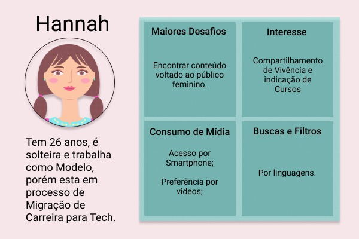
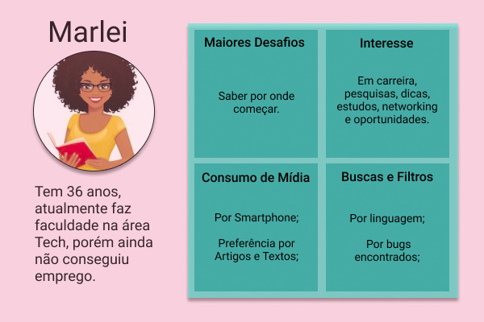
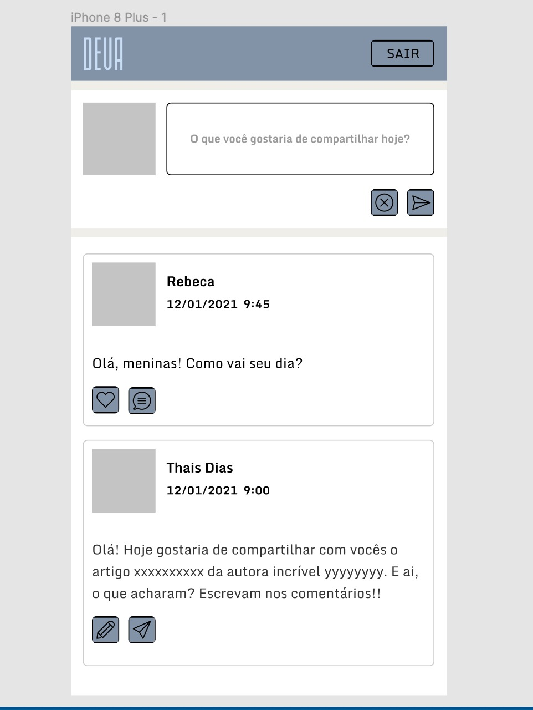

# DEVa | Social Network

DEVa é uma rede social desenvolvida por mulheres e para mulheres. Foi idealizada para ser um espaço de troca de conhecimento e uma rede de apoio entre mulheres desenvolvedoras. 
[**Acesse a  DEVa**](https://rede-social-79057.firebaseapp.com/) :purple_heart:
> Status do Projeto: Concluído :heavy_check_mark:

## Índice

- [1. Apresentação do Projeto](#1-apresentação-do-projeto)
- [2. Desenvolvedoras](#2-desenvolvedoras)
- [3. Planejamento](#3-planejamento)
- [4. Desenvolvimento](#4-desenvolvimento)
  - [4.1 Definição do Produto](#4.1-definição-do-produto)
  - [4.2 Histórias de Usuário](#4.2-histórias-de-usuário)
  - [4.3 Paleta de Cores](#4.3-paleta-de-cores)
  - [4.4 Protótipos Mobile](#4.4-protótipos-mobile)
  - [4.5Protótipos Desktop](#4.5-protótipos-desktop)
- [5. Habilidades Desenvolvidas](#5-habilidades-desenvolvidas)

---

## 1. Apresentação do Projeto

O projeto DEVa tem como público alvo mulheres que estudam, trabalham e se interessam por tecnologia. Nosso intuito é construir um espaço onde essas mulheres podem se encontrar e trocar conhecimento, experiências, informações sobre trabalhos e o que mais tenham interesse sobre esse mundo _tech_ tão abrangente no qual trabalhamos. Também foi pensado para ser um espaço de acolhimento e apoio entre essas mulheres, que muitas vezes precisam de mentoria para começar no mundo _tech_ e tem dificuldade de encontrar esse apoio em outros canais. 
Conheça um pouco da aplicação e como poderá usá-la.

## 2. Desenvolvedoras :computer:

Para conhecer um pouco mais do trabalho de cada uma das desenvolvedoras responsáveis pela realização desse projeto clique nos nomes delas a seguir:

:octocat: [**Camila Oliveira**](https://github.com/cbalieiro) 

:octocat: [**Rebeca Canesin**](https://github.com/rebecaCanesin)

:octocat: [**Thais Wemberlaine**](https://github.com/ThWember) 

---

## 3. Planejamento :memo:

A equipe utilizou a ferramenta _Trello_ para fazer todo o planejamento e organização do projeto. Abaixo a imagem do quadro que a equipe criou para tal fim. 

As tarefas foram dividas entre os membros da equipe utilizando a designação de membro responsável por cada atividade com auxílio dos cards. Se quiser saber um pouco mais sobre nosso planejamento e a maneira como dividimos as tarefas, pode acessar nosso quadro através desse [link](link para o quadro do trello).

## 4. Desenvolvimento :bulb:

### 4.1 Definição do produto

No `README.md`, conte-nos brevemente como você mapeou as necessidades dos seus
usuários e como você chegou à definição final do seu produto. É importante que
detalhe:

- Quem são os principais usuários do produto.
- Qual problema o produto resolve/para que ele serve para esses usuários.

### 4.2 Histórias de usuário

Depois de entender as necessidades de seus usuários, escreva as Histórias de
Usuário. Elas representam tudo o que ele precisa fazer/ver na Rede Social. Cada
uma de suas histórias de usuário deve possuir:
#### :mag_right: Pesquisa com usuárias 

O projeto partiu de uma pesquisa com usuárias em potencial da aplicação. Vinte e quatro desenvolvedoras responderam um questionário desenvolvido na ferramenta de formulário do Google. Essa pesquisa nos trouxe os seguintes resultados:

* Validou a necessidade de criar uma rede social somente para desenvolvedoras

* Demonstrou que o login na rede social com a utilização das contas do Google e GitHub estavam entre as três mais desejadas. Então optamos por utilizá-las

* Demonstrou que o segundo tipo de mídia mais interessante para as usuárias é o texto. A partir disso optamos por implementar esse tipo de mídia primeiro

* Validou a escolha de desenvolver o projeto a partir do método _mobile first_

#### :woman: Protopersonas

  
### 4.3 Paleta de Cores :art:

Pensando em trazer neutralidade para a página e cores que combinassem com um layout simples, a seguinte paleta de cores foi usada para a execução do projeto: 

### 4.4 Protótipos Mobile :iphone:

O projeto foi desenvolvido utilizando o método _mobile first_. Os seguintes protótipos foram desenhados para a aplicação e serviram como guia para a estilização da página. 
Desde o início o projeto foi pensado para ter um layout simples, que não cansasse as usuárias. Aumentando o tempo de permanência no site e melhorando a experiência, já que nosso público alvo tende a trabalhar muitas horas em frente ao computador e sabemos o quanto isso cansa.

#### :large_blue_circle: Página de Login e cadastro de conta de usuário 

#### :large_blue_circle: Página Timeline (linha do tempo)

### 4.5 Protótipos para Desktop

## 5. Habilidades Desenvolvidas :dart:

#### HTML e CSS

:pushpin: HTML semântico
:pushpin: CSS `flexbox`
:pushpin: Construir a aplicação respeitando o protótipo.

#### DOM

:pushpin: Manipulação do DOM

#### Javascript

:pushpin: Uso de callbacks
:pushpin: Consumo de Promises
:pushpin: Uso de ES modules

#### Firebase

:pushpin: Firestore
:pushpin: Firebase Auth

#### Testes

:pushpin: Teste unitários
:pushpin: Testes assíncronos
:pushpin: Mocking

#### Git e Github

:pushpin: Colaboração pelo Github

#### Boas práticas de programação

:pushpin: Modularização
:pushpin: Nomenclatura / Semântica
:pushpin: Linting

#### Soft Skills

:pushpin: Colaboração
:pushpin: Trabalho em equipe
:pushpin: Empatia
:pushpin: Diálogo entre membros da equipe
:pushpin: Planejamento

---

